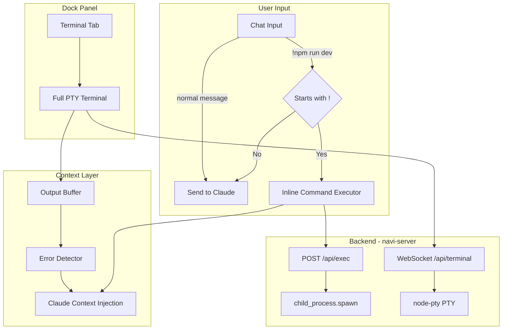

# Terminal Integration

> **Status: Implemented**

## Overview

Terminal/bash functionality is integrated into Navi with two interaction modes:
1. **Dock Terminal** - Persistent PTY terminal in the right panel ("Dock")
2. **Inline `!commands`** - Quick command execution from chat input

The key differentiator: **Claude has context of terminal output** for powerful debugging assistance.

---

## Architecture



---

## UI Integration

### Dock Panel (Right Sidebar)

Terminal appears as a new tab in the Dock alongside Files, Preview, Browser, and Git:

```
┌──────────┬────────────────────────┬──────────────────────┐
│          │                        │[Files][Preview][Terminal]│
│ Sidebar  │      Chat Area         │ ─────────────────────│
│          │                        │ $ npm run dev        │
│          │                        │ > vite server on 3000│
│          │                        │ [📤 Send to Claude]  │
└──────────┴────────────────────────┴──────────────────────┘
```

### Inline Commands in Chat

Type `!command` to execute directly without sending to Claude:

```
┌─────────────────────────────────────────────────────────┐
│ You: !npm test                                          │
├─────────────────────────────────────────────────────────┤
│ ┌─────────────────────────────────────────────────────┐ │
│ │ $ npm test                                          │ │
│ │ > navi@0.1.0 test                                   │ │
│ │ > vitest                                            │ │
│ │ ✓ 42 tests passed                          [Stop]   │ │
│ └─────────────────────────────────────────────────────┘ │
└─────────────────────────────────────────────────────────┘
```

### Interactive Command Handoff

For commands that need user input (like `sudo`), Claude's code blocks get a "Run in Dock" button:

```
┌─────────────────────────────────────────────────────────┐
│ 🤖 Claude: You need to restart the audio daemon.        │
│ ┌─────────────────────────────────────────────────────┐ │
│ │ BASH                                   [▶ Run in Dock]│ │
│ │ sudo killall coreaudiod                             │ │
│ └─────────────────────────────────────────────────────┘ │
└─────────────────────────────────────────────────────────┘
```

Clicking "Run in Dock" pastes the command into the Dock terminal (doesn't auto-execute for safety).

---

## Claude Context Integration

### The Problem

Without context integration, Claude can't see what happens in the terminal:

```
User: !npm run dev
Terminal: [errors]
User: "Why isn't it working?"
Claude: "I can't see the terminal output"
```

### The Solution

| Source | Claude Sees It? | How |
|--------|-----------------|-----|
| `!command` inline | ✅ Yes | Part of chat message thread |
| Dock terminal | 🔄 On request | "Send to Claude" button |
| Dock terminal errors | ⚡ Auto-suggested | Error detection + prompt |
| Claude's Bash tool | ✅ Yes | Tool result in context |

### Output Buffer

Keep rolling buffer of last 500 lines per terminal session:

```typescript
const terminalBuffers = new Map<string, string[]>();

// On output, capture to buffer
buffer.push(output);
if (buffer.length > 500) buffer.shift();
```

### Error Detection

Auto-detect errors and prompt user:

```typescript
const errorPatterns = [
  /error:/i,
  /failed/i,
  /exception/i,
  /ENOENT/,
  /Cannot find/,
  /ERR!/,
];

if (errorPatterns.some(p => p.test(output))) {
  emit('terminal:error', { sessionId, context: last50Lines });
}
```

```
┌─────────────────────────────────────────────────┐
│ ⚠️ Error detected in terminal                   │
│ [Ask Claude for help]  [Dismiss]                │
└─────────────────────────────────────────────────┘
```

---

## Implementation Status

| Phase | Description | Status |
|-------|-------------|--------|
| 1 | Backend terminal routes | ✅ Completed |
| 2 | Inline !commands in chat | ✅ Completed |
| 3 | Terminal tab in Dock | ✅ Completed |
| 4 | Send to Claude button | ✅ Completed |
| 5 | Error detection & prompts | ✅ Completed |
| 6 | Context injection | ✅ Completed |

---

## Implementation Phases

### Phase 1: Backend - Command Execution ✅

**Files:**
- `server/routes/terminal.ts`
- `server/index.ts` (register routes)
- `server/websocket/handler.ts` (PTY message handling)

**Endpoints:**

```typescript
// Simple command execution with streaming output
POST /api/exec
Body: { command: string, cwd?: string, env?: Record<string, string> }
Response: SSE stream of stdout/stderr
  event: stdout | stderr | exit
  data: { content: string } | { code: number }

// Kill running command
DELETE /api/exec/:pid

// PTY terminal WebSocket
WS /api/terminal
Messages:
  → { type: 'spawn', cwd?: string, shell?: string }
  → { type: 'input', data: string }
  → { type: 'resize', cols: number, rows: number }
  ← { type: 'output', data: string }
  ← { type: 'exit', code: number }

// Get terminal buffer for Claude context
GET /api/terminal/:sessionId/buffer?lines=100
Response: { lines: string[], sessionId: string }
```

**Dependencies:**
```bash
cd packages/navi-app
bun add node-pty
```

---

### Phase 2: Inline `!commands` in Chat ✅

**Files:**
- `src/lib/components/InlineCommandBlock.svelte`
- `src/lib/components/ChatInput.svelte`
- `src/lib/api.ts`

**Behavior:**
1. Intercept messages starting with `!` in ChatInput
2. Strip `!`, execute command via `/api/exec`
3. Render `InlineCommandBlock` in message thread
4. Stream output with ANSI color support
5. Show Stop button for long-running commands
6. Add "Open in Dock" button to promote to persistent terminal

**Component:**
```svelte
<!-- InlineCommandBlock.svelte -->
<script lang="ts">
  export let command: string;
  export let cwd: string;

  let output: string = '';
  let running = true;
  let exitCode: number | null = null;
</script>

<div class="command-block">
  <div class="header">
    <span class="prompt">$</span>
    <span class="command">{command}</span>
    {#if running}
      <button on:click={stop}>Stop</button>
    {/if}
  </div>
  <pre class="output">{@html ansiToHtml(output)}</pre>
  {#if exitCode !== null}
    <div class="exit-code" class:error={exitCode !== 0}>
      Exit: {exitCode}
    </div>
  {/if}
  <button on:click={openInDock}>Open in Dock</button>
</div>
```

---

### Phase 3: Terminal Tab in Dock ✅

**Files:**
- `src/lib/components/TerminalPanel.svelte`
- `src/lib/layout/RightPanel.svelte`
- `src/App.svelte`

**Dependencies:**
```bash
cd packages/navi-app
bun add xterm xterm-addon-fit xterm-addon-web-links
```

**Component:**
```svelte
<!-- TerminalPanel.svelte -->
<script lang="ts">
  import { Terminal } from 'xterm';
  import { FitAddon } from 'xterm-addon-fit';
  import { WebLinksAddon } from 'xterm-addon-web-links';
  import { onMount, onDestroy } from 'svelte';

  export let cwd: string;

  let terminalEl: HTMLDivElement;
  let terminal: Terminal;
  let ws: WebSocket;
  let outputBuffer: string[] = [];

  onMount(() => {
    terminal = new Terminal({
      cursorBlink: true,
      fontSize: 13,
      fontFamily: 'JetBrains Mono, monospace',
      theme: { background: '#1a1a2e' }
    });

    const fitAddon = new FitAddon();
    terminal.loadAddon(fitAddon);
    terminal.loadAddon(new WebLinksAddon());

    terminal.open(terminalEl);
    fitAddon.fit();

    // Connect WebSocket
    ws = new WebSocket(`ws://localhost:3001/api/terminal`);
    ws.onopen = () => {
      ws.send(JSON.stringify({ type: 'spawn', cwd }));
    };
    ws.onmessage = (e) => {
      const msg = JSON.parse(e.data);
      if (msg.type === 'output') {
        terminal.write(msg.data);
        captureOutput(msg.data);
      }
    };

    // Send input to PTY
    terminal.onData(data => {
      ws.send(JSON.stringify({ type: 'input', data }));
    });

    // Handle resize
    const resizeObserver = new ResizeObserver(() => {
      fitAddon.fit();
      ws.send(JSON.stringify({
        type: 'resize',
        cols: terminal.cols,
        rows: terminal.rows
      }));
    });
    resizeObserver.observe(terminalEl);
  });

  function captureOutput(data: string) {
    outputBuffer.push(data);
    if (outputBuffer.length > 500) outputBuffer.shift();
    checkForErrors(data);
  }

  function sendToClaude() {
    const context = outputBuffer.slice(-100).join('');
    dispatch('sendContext', { type: 'terminal', content: context });
  }
</script>

<div class="terminal-container">
  <div class="terminal-header">
    <span>Terminal</span>
    <button on:click={sendToClaude}>📤 Send to Claude</button>
  </div>
  <div bind:this={terminalEl} class="terminal"></div>
</div>
```

---

### Phase 4: Interactive Command Handoff

**Files:**
- `src/lib/components/tools/BashPreview.svelte` (modify)

**Changes:**
Add "Run in Dock" button to Claude's bash code blocks:

```svelte
<button on:click={() => runInDock(command)}>
  ▶ Run in Dock
</button>
```

`runInDock` function:
1. Opens/focuses Terminal tab in Dock
2. Sends command to terminal (pastes, doesn't execute)
3. User presses Enter to run

---

### Phase 5: Error Detection & Auto-Context

**Files:**
- `src/lib/stores/terminal.ts` (add error detection)
- `src/lib/components/TerminalErrorPrompt.svelte` (new)

**Error Detection:**
```typescript
const errorPatterns = [
  /error:/i,
  /ERR!/,
  /failed/i,
  /exception/i,
  /ENOENT/,
  /Cannot find module/,
  /command not found/,
  /permission denied/i,
  /EACCES/,
  /ECONNREFUSED/,
];

function checkForErrors(output: string): boolean {
  return errorPatterns.some(p => p.test(output));
}
```

**Prompt Component:**
```svelte
<!-- TerminalErrorPrompt.svelte -->
{#if errorDetected}
  <div class="error-prompt">
    <span>⚠️ Error detected in terminal</span>
    <button on:click={askClaude}>Ask Claude for help</button>
    <button on:click={dismiss}>Dismiss</button>
  </div>
{/if}
```

---

### Phase 6: Context Injection for Claude

**Files:**
- `src/lib/api.ts` (modify sendMessage)

**Auto-inject terminal context when user mentions errors:**
```typescript
async function sendMessage(content: string, options: SendOptions) {
  let contextPrefix = '';

  // Check if user is asking about terminal/errors
  const terminalKeywords = [
    'terminal', 'error', 'failed', 'not working',
    'what happened', 'why did', 'logs'
  ];

  if (terminalKeywords.some(k => content.toLowerCase().includes(k))) {
    const terminalBuffer = getActiveTerminalBuffer();
    if (terminalBuffer.length > 0) {
      contextPrefix = `<terminal_context>\n${terminalBuffer.slice(-50).join('')}\n</terminal_context>\n\n`;
    }
  }

  // Send to API with context
  return api.chat({
    ...options,
    content: contextPrefix + content
  });
}
```

---

## File Changes Summary

| File | Action | Description |
|------|--------|-------------|
| `server/routes/terminal.ts` | Create | Terminal API endpoints |
| `server/index.ts` | Modify | Register terminal routes |
| `src/lib/api.ts` | Modify | Add exec/terminal helpers |
| `src/lib/components/ChatInput.svelte` | Modify | Intercept `!` commands |
| `src/lib/components/InlineCommandBlock.svelte` | Create | Inline command execution |
| `src/lib/components/TerminalPanel.svelte` | Create | Full PTY terminal |
| `src/lib/components/TerminalErrorPrompt.svelte` | Create | Error detection UI |
| `src/lib/stores/terminal.ts` | Create | Terminal state management |
| `src/App.svelte` | Modify | Add Terminal tab to Dock |
| `src/lib/components/tools/BashPreview.svelte` | Modify | Add "Run in Dock" button |
| `package.json` | Modify | Add xterm dependencies |

---

## Dependencies

**Frontend:**
```bash
bun add xterm xterm-addon-fit xterm-addon-web-links ansi-to-html
```

**Backend:**
```bash
bun add node-pty @types/node-pty
```

---

## Security Considerations

- Commands run with user's permissions (Tauri is native, no sandboxing needed)
- No remote execution - all commands run locally
- "Run in Dock" pastes but doesn't auto-execute for safety
- Consider optional command allowlist/blocklist for dangerous patterns

---

## Future Enhancements

- [ ] Multiple terminal tabs
- [ ] Terminal session persistence across app restarts
- [ ] Command history (per-project)
- [ ] Split terminal view
- [ ] SSH/remote terminal support
- [ ] Integrated task runner (detect package.json scripts)
